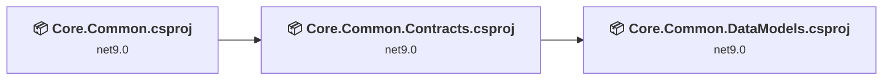
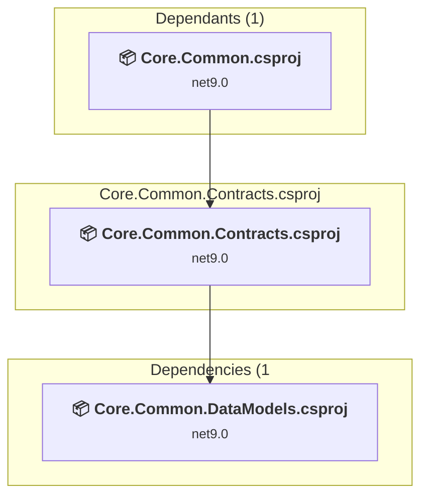
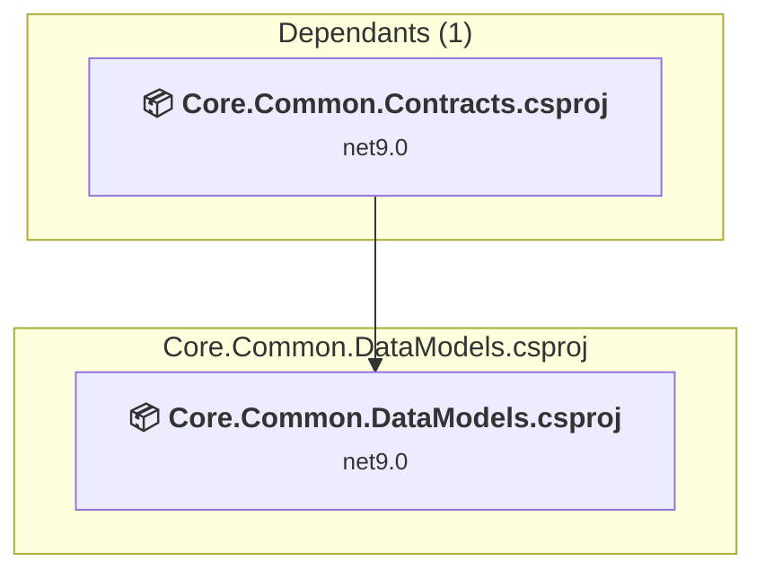
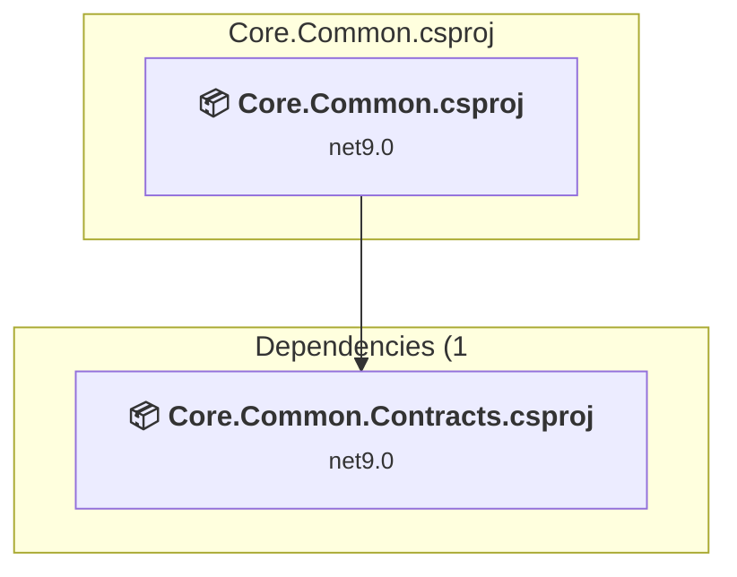

# Projects and dependencies analysis

This document provides a comprehensive overview of the projects and their dependencies in the context of upgrading to .NETCoreApp,Version=v10.0.

## Table of Contents

- [Executive Summary](#executive-Summary)
  - [Highlevel Metrics](#highlevel-metrics)
  - [Projects Compatibility](#projects-compatibility)
  - [Package Compatibility](#package-compatibility)
  - [API Compatibility](#api-compatibility)
- [Aggregate NuGet packages details](#aggregate-nuget-packages-details)
- [Top API Migration Challenges](#top-api-migration-challenges)
  - [Technologies and Features](#technologies-and-features)
  - [Most Frequent API Issues](#most-frequent-api-issues)
- [Projects Relationship Graph](#projects-relationship-graph)
- [Project Details](#project-details)

  - [Core.Common.Contracts\Core.Common.Contracts.csproj](#corecommoncontractscorecommoncontractscsproj)
  - [Core.Common.DataModels\Core.Common.DataModels.csproj](#corecommondatamodelscorecommondatamodelscsproj)
  - [Core.Common\Core.Common.csproj](#corecommoncorecommoncsproj)

## Executive Summary

### Highlevel Metrics

| Metric | Count | Status |
| :--- | :---: | :--- |
| Total Projects | 3 | All require upgrade |
| Total NuGet Packages | 8 | 4 need upgrade |
| Total Code Files | 50 |  |
| Total Code Files with Incidents | 3 |  |
| Total Lines of Code | 1376 |  |
| Total Number of Issues | 8 |  |
| Estimated LOC to modify | 0+ | at least 0.0% of codebase |

### Projects Compatibility

| Project | Target Framework | Difficulty | Package Issues | API Issues | Est. LOC Impact | Description |
| :--- | :---: | :---: | :---: | :---: | :---: | :--- |
| [Core.Common.Contracts\Core.Common.Contracts.csproj](#corecommoncontractscorecommoncontractscsproj) | net9.0 | 🟢 Low | 1 | 0 |  | ClassLibrary, Sdk Style = True |
| [Core.Common.DataModels\Core.Common.DataModels.csproj](#corecommondatamodelscorecommondatamodelscsproj) | net9.0 | 🟢 Low | 1 | 0 |  | ClassLibrary, Sdk Style = True |
| [Core.Common\Core.Common.csproj](#corecommoncorecommoncsproj) | net9.0 | 🟢 Low | 3 | 0 |  | ClassLibrary, Sdk Style = True |

### Package Compatibility

| Status | Count | Percentage |
| :--- | :---: | :---: |
| ✅ Compatible | 4 | 50.0% |
| ⚠️ Incompatible | 0 | 0.0% |
| 🔄 Upgrade Recommended | 4 | 50.0% |
| ***Total NuGet Packages*** | ***8*** | ***100%*** |

### API Compatibility

| Category | Count | Impact |
| :--- | :---: | :--- |
| 🔴 Binary Incompatible | 0 | High - Require code changes |
| 🟡 Source Incompatible | 0 | Medium - Needs re-compilation and potential conflicting API error fixing |
| 🔵 Behavioral change | 0 | Low - Behavioral changes that may require testing at runtime |
| ✅ Compatible | 1410 |  |
| ***Total APIs Analyzed*** | ***1410*** |  |

## Aggregate NuGet packages details

| Package | Current Version | Suggested Version | Projects | Description |
| :--- | :---: | :---: | :--- | :--- |
| Ardalis.GuardClauses | 5.0.0 |  | [Core.Common.csproj](#corecommoncorecommoncsproj) | ✅Compatible |
| Microsoft.AspNetCore.Identity | 2.3.0 | 2.3.9 | [Core.Common.csproj](#corecommoncorecommoncsproj) | NuGet package contains security vulnerability |
| Microsoft.AspNetCore.Identity.EntityFrameworkCore | 9.0.1 | 10.0.5 | [Core.Common.DataModels.csproj](#corecommondatamodelscorecommondatamodelscsproj) | NuGet package upgrade is recommended |
| Microsoft.AspNetCore.Mvc | 2.3.0 |  | [Core.Common.csproj](#corecommoncorecommoncsproj) | ✅Compatible |
| Microsoft.EntityFrameworkCore | 9.0.1 | 10.0.5 | [Core.Common.Contracts.csproj](#corecommoncontractscorecommoncontractscsproj) [Core.Common.csproj](#corecommoncorecommoncsproj) | NuGet package upgrade is recommended |
| Newtonsoft.Json | 13.0.3 | 13.0.4 | [Core.Common.csproj](#corecommoncorecommoncsproj) | NuGet package upgrade is recommended |
| REST-Parser | 1.2.5 |  | [Core.Common.Contracts.csproj](#corecommoncontractscorecommoncontractscsproj) [Core.Common.csproj](#corecommoncorecommoncsproj) | ✅Compatible |
| System.IdentityModel.Tokens.Jwt | 8.3.1 |  | [Core.Common.csproj](#corecommoncorecommoncsproj) | ✅Compatible |

## Top API Migration Challenges

### Technologies and Features

| Technology | Issues | Percentage | Migration Path |
| :--- | :---: | :---: | :--- |

### Most Frequent API Issues

| API | Count | Percentage | Category |
| :--- | :---: | :---: | :--- |

## Projects Relationship Graph

Legend:
📦 SDK-style project
⚙️ Classic project

## Project Details

### Core.Common.Contracts\Core.Common.Contracts.csproj

#### Project Info

- **Current Target Framework:** net9.0
- **Proposed Target Framework:** net10.0
- **SDK-style**: True
- **Project Kind:** ClassLibrary
- **Dependencies**: 1
- **Dependants**: 1
- **Number of Files**: 16
- **Number of Files with Incidents**: 1
- **Lines of Code**: 236
- **Estimated LOC to modify**: 0+ (at least 0.0% of the project)

#### Dependency Graph

Legend:
📦 SDK-style project
⚙️ Classic project

### API Compatibility

| Category | Count | Impact |
| :--- | :---: | :--- |
| 🔴 Binary Incompatible | 0 | High - Require code changes |
| 🟡 Source Incompatible | 0 | Medium - Needs re-compilation and potential conflicting API error fixing |
| 🔵 Behavioral change | 0 | Low - Behavioral changes that may require testing at runtime |
| ✅ Compatible | 67 |  |
| ***Total APIs Analyzed*** | ***67*** |  |

### Core.Common.DataModels\Core.Common.DataModels.csproj

#### Project Info

- **Current Target Framework:** net9.0
- **Proposed Target Framework:** net10.0
- **SDK-style**: True
- **Project Kind:** ClassLibrary
- **Dependencies**: 0
- **Dependants**: 1
- **Number of Files**: 18
- **Number of Files with Incidents**: 1
- **Lines of Code**: 253
- **Estimated LOC to modify**: 0+ (at least 0.0% of the project)

#### Dependency Graph

Legend:
📦 SDK-style project
⚙️ Classic project

### API Compatibility

| Category | Count | Impact |
| :--- | :---: | :--- |
| 🔴 Binary Incompatible | 0 | High - Require code changes |
| 🟡 Source Incompatible | 0 | Medium - Needs re-compilation and potential conflicting API error fixing |
| 🔵 Behavioral change | 0 | Low - Behavioral changes that may require testing at runtime |
| ✅ Compatible | 213 |  |
| ***Total APIs Analyzed*** | ***213*** |  |

### Core.Common\Core.Common.csproj

#### Project Info

- **Current Target Framework:** net9.0
- **Proposed Target Framework:** net10.0
- **SDK-style**: True
- **Project Kind:** ClassLibrary
- **Dependencies**: 1
- **Dependants**: 0
- **Number of Files**: 16
- **Number of Files with Incidents**: 1
- **Lines of Code**: 887
- **Estimated LOC to modify**: 0+ (at least 0.0% of the project)

#### Dependency Graph

Legend:
📦 SDK-style project
⚙️ Classic project

### API Compatibility

| Category | Count | Impact |
| :--- | :---: | :--- |
| 🔴 Binary Incompatible | 0 | High - Require code changes |
| 🟡 Source Incompatible | 0 | Medium - Needs re-compilation and potential conflicting API error fixing |
| 🔵 Behavioral change | 0 | Low - Behavioral changes that may require testing at runtime |
| ✅ Compatible | 1130 |  |
| ***Total APIs Analyzed*** | ***1130*** |  |

